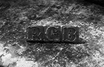

# RGB Single Page Website

## Dropbox 

        www.dropbox.com

#### Then
   
    https://www.dropbox.com/home/website

#### Right click on the file

### Share
    
    https://www.dropbox.com/s/hkaub6mhwi184pz/magcroWidgetContent.js?dl=0

#### Change the format to this

    dl.dropbox.com/s/hkaub6mhwi184pz/magcroWidgetContent.js

Format when inserted inside the HEAD

        <script src='https://dl.dropbox.com/s/hkaub6mhwi184pz/magcroWidgetContent.js' type='text/javascript'/>

## Setting up a blank page in Blogger

    http://subinsb.com/make-a-blank-blogger-template

## Blogger template source

    http://www.mybloggerthemes.com/2014/10/magcro-parallax.html

## Checklist

* Dropbox link to javascript
* Remove Logo

    .uj_bottom_arrow display:none;

* Remove Bubbles
* Adjust Menu Titles
* Remove About Me Google account
* Create
    + Facebook
    + LinkdIN
    + Pinterest
    + Google+
* Remove facebook on the sidebar
* Fix google maps locatioh
* Edit Images
    - Use for website
    - Black and white photos
    - 3000 x 2000 px size
    - pic ni tatay
    - About Us

## Images

Banner_adjust

Banner2

BG1

BG2

BG3

BG4

BG5
